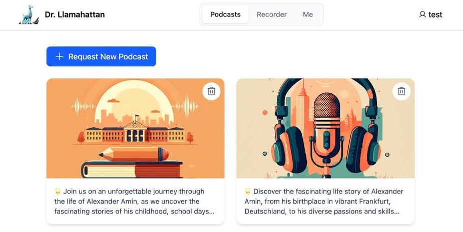

# dr-llamahattan
LlamaCon Hackathon 2025 Project using Llama 4 API to preserve human memories.

We capture raw audio by simply listening to humans and turning their lifes into a podcast with individual episodes, ready to be enjoyed.

🦙 where LLama API is used:
- **llamaClient.ts** Llama API - Chat Completion with Structured Output & Train-of-Thought
- **toLLSchema.ts** Llama API - Handling prompt structures
- **promot*.ts** Handling prompt-to-strucutre mappings for local outputs

## ⚡ how it works
- Raw audio is captured using our browser-based recorder app that we've built during the hackathon
- The audio is streamed to a Whisper instance transcribing hours of life stories
- Llama 4 API then takes it all in and structures the life stories within it's large context
- Llama 4 outputs a podcast with individual episodes that are turned into audio using a Text-to-Speech model 
- Context-aware cover images are generated for each podcast episode
- The metadata and audio files are finally turned into a beautiful consumer website to browse and enjoy the final podcast

## 📄 inputs
- Raw audio captured using our recorder browser app

## 📺 outputs
- Podcast audio and structured metadata wrapped in a consumer website

## 🧑‍💻 contributors
- Alex Amin, https://www.linkedin.com/in/alex-amin/
- Olcay Buyan, https://www.linkedin.com/in/olcaybuyan/